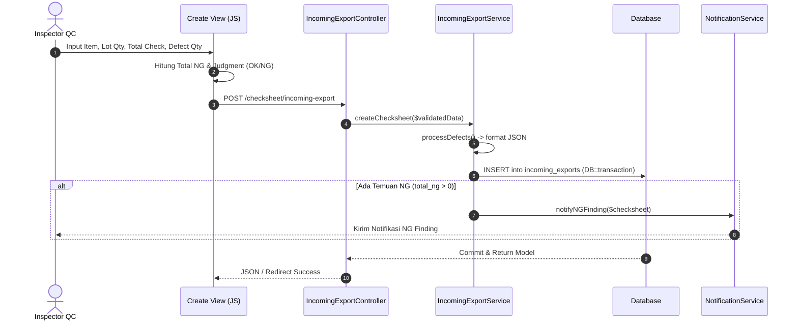

# Dokumentasi Kode Lengkap Modul Incoming Export

Dokumen teknis terperinci ini menyajikan panduan arsitektur, skema database, alur logika backend, struktur frontend, serta spesifikasi API/Routing untuk modul **Incoming Export** pada sistem Quality Control (QC).

---

## 1. Pendahuluan & Arsitektur Modul

Modul **Incoming Export** bertugas mencatat, mengelola, memverifikasi, serta menyetujui (*approval*) hasil pemeriksaan barang/part hasil inspeksi kedatangan ekspor (*Incoming Export Checksheet*). 

Modul ini dibangun menggunakan pola arsitektur **Laravel MVC + Service Layer Pattern**, serta memanfaatkan **Traits** untuk memisahkan fungsi umum (*reusable mixins*) seperti approval berjenjang, penanganan multi-plant, notifikasi penghapusan, dan ekspor data.

### Komponen Utama Sistem
- **Model Eloquent:** `App\Models\IncomingExport`
- **Controller Layer:** `App\Http\Controllers\IncomingExportController`
- **Service Layer:** `App\Services\IncomingExportService`
- **Form Request Validation:** 
  - `App\Http\Requests\StoreIncomingExportRequest`
  - `App\Http\Requests\UpdateIncomingExportRequest`
- **Traits Terintegrasi:**
  - `App\Traits\HasChecksheetApproval` (Fungsi approval 4 tingkat & rejection)
  - `App\Traits\HasChecksheetExport` (Fungsi ekspor CSV & Google Sheets sync)
  - `App\Traits\HasPlantFilter` (Auto-scope data berdasarkan Plant pengguna)
  - `App\Traits\HasDeleteNotification` (Notifikasi penghapusan data)
- **Views (Blade):** `resources/views/incoming/exports/*`

---

## 2. Skema Database & Model Data (`incoming_exports`)

Tabel `incoming_exports` menyimpan data riwayat inspeksi fisik barang masuk untuk kategori barang ekspor.

### A. Struktur Kolom Database

| Nama Kolom | Tipe Data | Nullable | Deskripsi / Catatan |
| :--- | :--- | :---: | :--- |
| `id` | `bigint (unsigned)` | NO | Primary Key (Auto Increment) |
| `plant_id` | `bigint (unsigned)` | NO | Foreign Key ke tabel `plants` |
| `item_id` | `bigint (unsigned)` | NO | Foreign Key ke tabel `items` |
| `standard` | `text` | YES | Acuan standar inspeksi barang |
| `date` | `date` | NO | Tanggal pelaksanaan inspeksi QC |
| `tanggal_delivery` | `date` | NO | Tanggal kedatangan / pengiriman barang |
| `lot_qty` | `int` | NO | Jumlah total kuantitas per lot |
| `total_check` | `int` | NO | Jumlah sampel barang yang diperiksa |
| `judgment` | `enum('OK','NG')` | NO | Hasil keputusan akhir inspeksi |
| `defects` | `json` | YES | Data keragaman jenis & kuantitas cacat/defect dalam JSON |
| `total_ng` | `int` | YES (Default: 0) | Total unit yang mengalami kerusakan/NG |
| `operator_initials` | `varchar(255)` | YES | Inisial/Nama pemeriksa (QC Inspector) |
| `remarks` | `text` | YES | Catatan atau keterangan tambahan |
| `approval_status` | `varchar(255)` | YES | Status approval akhir (`Pending`, `Approved`, `Rejected`) |
| `kashift_qc` | `varchar(255)` | YES | Nama / Penanda Approval Kepala Shift QC |
| `supervisor_qc` | `varchar(255)` | YES | Nama / Penanda Approval Supervisor QC |
| `asst_manager_qc` | `varchar(255)` | YES | Nama / Penanda Approval Asst. Manager QC |
| `manager_qc` | `varchar(255)` | YES | Nama / Penanda Approval Manager QC |
| `kashift_approved_at` | `datetime` | YES | Waktu persetujuan Kepala Shift QC |
| `supervisor_approved_at` | `datetime` | YES | Waktu persetujuan Supervisor QC |
| `asst_manager_approved_at` | `datetime` | YES | Waktu persetujuan Asst. Manager QC |
| `manager_approved_at` | `datetime` | YES | Waktu persetujuan Manager QC |
| `part_code` | `varchar(255)` | YES | Kode Part opsional dari QR Code/Label |
| `supplier_id` | `varchar(255)` | YES | ID/Kode Supplier |
| `quantity` | `int` | YES | Kuantitas spesifik dari scan label/QR |
| `unique_code_id` | `varchar(255)` | YES | ID unik serial/QR code label |
| `sap_code` | `varchar(255)` | YES | Kode material SAP |
| `scan_method` | `varchar(255)` | YES | Metode input (`scan` / `manual`) |
| `qrcode` | `text` | YES | Teks mentah hasil pembacaan QR Code |
| `cycle_time` | `int` | YES | Waktu durasi pemeriksaan dalam detik |
| `rejection_remarks` | `text` | YES | Catatan penolakan jika laporan di-reject |
| `created_at` / `updated_at` | `timestamp` | YES | Standard Eloquent Timestamps |

### B. Relasi Model Eloquent (`App\Models\IncomingExport`)

```php
// Relasi ke Master Barang/Part
public function item()
{
    return $this->belongsTo(Item::class);
}

// Relasi ke Plant (Lokasi Pabrik)
public function plant()
{
    return $this->belongsTo(Plant::class);
}
```

---

## 3. Daftar Routing & Endpoints

Seluruh *route* modul terdaftar di `routes/checksheets.php` dalam *middleware group* `auth`.

| HTTP Method | URI Endpoint | Nama Route | Action Controller / Trait | Deskripsi Fungsi |
| :---: | :--- | :--- | :--- | :--- |
| `GET` | `/checksheet/incoming-export` | `incoming.exports.create` | `IncomingExportController@create` | Tampilan formulir input checksheet baru |
| `POST` | `/checksheet/incoming-export` | `incoming.exports.store` | `IncomingExportController@store` | Menyimpan data checksheet baru |
| `GET` | `/report/incoming-export` | `incoming.exports.index` | `IncomingExportController@index` | Tampilan tabel laporan & filter data |
| `GET` | `/report/incoming-export/export-pdf` | `incoming.exports.export_pdf` | `IncomingExportController@exportPdf` | Mengunduh laporan versi DomPDF (Landscape) |
| `GET` | `/admin/incoming-export/{id}/edit` | `incoming.exports.edit` | `IncomingExportController@edit` | Form edit data checksheet |
| `PUT` | `/admin/incoming-export/{id}` | `incoming.exports.update` | `IncomingExportController@update` | Memperbarui data checksheet yang ada |
| `DELETE` | `/admin/incoming-export/{id}` | `incoming.exports.destroy` | `IncomingExportController@destroy` | Menghapus baris data checksheet |
| `POST` | `/incoming-export/{id}/approve/{type}` | `incoming.exports.approve` | `HasChecksheetApproval@approve` | Approval individu berdasarkan peran (Kashift/SPV/Manager) |
| `POST` | `/incoming-export/{id}/reject/{type}` | `incoming.exports.reject` | `HasChecksheetApproval@reject` | Rejection individu disertai catatan *rejection_remarks* |
| `POST` | `/incoming-export/bulk-approve` | `incoming.exports.bulk_approve` | `IncomingExportController@bulkApprove` | Persetujuan sekaligus untuk rentang tanggal tertentu |
| `GET` | `/admin/incoming-export/{id}/edit-approval` | `admin.incoming.exports.edit_approval` | `IncomingExportController@editApproval` | Form penyesuaian status approval (Admin override) |
| `PUT` | `/admin/incoming-export/{id}/update-approval` | `admin.incoming.exports.update_approval` | `IncomingExportController@updateApproval` | Simpan override status approval (Admin) |

---

## 4. Penjelasan Terperinci Komponen Backend

### A. Controller Layer (`IncomingExportController`)
Controller mengelola permintaan HTTP, memanggil Service Layer, dan mengembalikan tampilan Blade atau JSON Response.

```php
namespace App\Http\Controllers;

class IncomingExportController extends Controller
{
    use HasChecksheetApproval, HasChecksheetExport;

    protected $checksheetService;

    public function __construct(IncomingExportService $checksheetService)
    {
        $this->checksheetService = $checksheetService;
    }
    
    // Konfigurasi model untuk Trait Approval & Export
    protected function getModelClass() { return IncomingExport::class; }
}
```

- **`index(Request $request)`**: Memfilter data melalui `$this->checksheetService->getFilteredChecksheets()` dan menampilkan item kategori `['Incoming Export', 'INPROSES', 'SUB ASSY']`.
- **`create(Request $request)`**: Menyediakan daftar item sesuai `plant_id` aktif serta menghitung nilai bawaan `defaultDate` dan `defaultShift` via `ShiftHelper`.
- **`store(StoreIncomingExportRequest $request)`**: Memanggil `createChecksheet` pada Service Layer. Jika permintaan bertipe AJAX/JSON, mengembalikan JSON response secara transparan.
- **`exportPdf(Request $request)`**: Membuat dokumen PDF lanskap menggunakan DomPDF dengan header pabrik dinamis.

### B. Service Layer (`IncomingExportService`)
Service Layer menangani seluruh alur logika bisnis (*Business Logic*), transaksi database (`DB::transaction`), kalkulasi defect JSON, dan trigger notifikasi.

```php
public function createChecksheet(array $data): array
{
    DB::beginTransaction();
    try {
        $defects = $this->processDefects($data);

        $checksheet = IncomingExport::create([
            'plant_id'          => $this->resolvePlantId($data['plant_id'] ?? auth()->user()->plant_id),
            'item_id'           => $data['item_id'],
            'standard'          => $data['standard'] ?? null,
            'date'              => $data['date'],
            'tanggal_delivery'  => $data['tanggal_delivery'],
            'lot_qty'           => $data['lot_qty'],
            'total_check'       => $data['total_check'],
            'judgment'          => $data['judgment'],
            'total_ng'          => $data['total_ng'] ?? 0,
            'operator_initials' => $data['operator_initials'] ?? null,
            'remarks'           => $data['remarks'] ?? null,
            'defects'           => json_encode($defects),
        ]);

        DB::commit();

        // Pemicu Notifikasi jika ditemukan NG
        if ($checksheet->total_ng > 0) {
            $this->notificationService->notifyNGFinding($checksheet, 'Incoming Export');
        }

        return ['checksheet' => $checksheet];
    } catch (\Exception $e) {
        DB::rollBack();
        throw $e;
    }
}
```

#### Pemrosesan Defect (`processDefects`)
Mengonversi susunan array `defect_types[]` dan `defect_quantities[]` dari formulir menjadi struktur array JSON bersih yang hanya menyimpan jenis defect dengan kuantitas `> 0`:
```php
private function processDefects(array $data): array
{
    $defects = [];
    if (isset($data['defect_types'])) {
        foreach ($data['defect_types'] as $index => $type) {
            if ($type) {
                $qty = $data['defect_quantities'][$index] ?? 0;
                if ((int)$qty > 0) {
                    $defects[] = ['type' => $type, 'qty' => (int) $qty];
                }
            }
        }
    }
    return $defects;
}
```

### C. Validation Requests (`StoreIncomingExportRequest` & `UpdateIncomingExportRequest`)
Memastikan integritas input batas kepercayaan (*trust boundaries*):
- `item_id`: Wajib, harus terdaftar di tabel `items`.
- `date` & `tanggal_delivery`: Wajib bertipe tanggal valid.
- `lot_qty` & `total_check`: Wajib integer positif (`min:0`).
- `judgment`: Wajib bernilai `OK` atau `NG`.

---

## 5. Komponen Frontend & Tampilan (Blade Views)

Seluruh tampilan modul diletakkan pada direktori `resources/views/incoming/exports/`:

### A. Tampilan Form Input (`create.blade.php`)
- Menggunakan *design pattern* UI konsisten Kakotora:
  - Input field: `.form-control.form-control-sm.border-0.shadow-sm`
  - Label: `.small.font-weight-bold.text-gray-700`
- Fitur Dinamis:
  - Pembacaan item via Select2 / Datalist Autocomplete.
  - Penambahan & penghapusan baris jenis defect secara dinamis menggunakan skrip JavaScript `public/js/checksheet/incoming-create.js`.
  - Kalkulasi total NG otomatis berdasarkan penjumlahan kuantitas defect.

### B. Tampilan Laporan & Tabel Utama (`index.blade.php`)
- **Action Bar:** Baris kontrol atas terpadu (`bg-light p-2 rounded mb-3 shadow-sm`) berisi pencarian kata kunci, filter tanggal kedatangan, filter status approval, tombol ekspor (PDF/CSV), dan tombol input data baru.
- **Tabel Data Responsif:**
  - Wrapper dengan `max-height: calc(100vh - 220px)` dan `overflow: auto`.
  - Sticky header (`#f8fafc`, font 0.62rem uppercase).
  - Tampilan *Defect breakdown* rapi per baris.
  - Badge Status Approval (`Approved` hijau, `Pending` kuning, `Rejected` merah).
- **Loading State:** Menampilkan spinner loader (`#tableLoader`) dan melakukan `fadeIn` pada tabel setelah render selesai.

### C. Dokumen Cetak PDF (`pdf.blade.php`)
- Format halaman: A4 Landscape.
- Menyajikan Kop Dokumen resmi (No. Dokumen, Tgl Terbit, Revisi, Halaman) yang dikonfigurasi melalui `GeneralSetting`.
- Menampilkan rincian seluruh item inspeksi dan kolom tanda tangan approval 4 tingkat (Kashift, Supervisor, Asst. Manager, Manager).

---

## 6. Alur Kerja Fitur Utama (Workflows)

### A. Alur Input Checksheet & Deteksi NG


### B. Alur Approval & Rejection Berjenjang
1. **Approval:**
   - Kashift QC / Supervisor QC / Asst. Manager / Manager menekan tombol *Approve*.
   - Trait `HasChecksheetApproval` memvalidasi hak akses per peran.
   - Kolom `[role]_qc` diisi nama pengguna dan `[role]_approved_at` diisi timestamp `now()`.
   - Setelah Supervisor/Manager menyetujui, `approval_status` berubah menjadi `Approved`.
2. **Rejection:**
   - Pengguna menekan tombol *Reject* dan memasukkan alasan penolakan pada modal SweetAlert2.
   - Kolom `[role]_qc` diisi `REJECTED`, `approval_status` diisi `Rejected`, dan catatan dimasukkan ke kolom `rejection_remarks`.
   - Sistem secara otomatis mengirim notifikasi ke pemeriksa (*Inspector*).

### C. Sistem Audio Validasi & Notifikasi Scan
Seluruh pemicuan auditif pada pemindaian QR Code dikonsolidasikan melalui helper global `window.playAppAudio(type)` pada `layouts/admin.blade.php`:
- `success` $\rightarrow$ `QR CODE BERHASIL DI SCAN.mp3` (disertai `Swal.fire` modal feedback).
- `format_error` $\rightarrow$ `FORMAT QR CODE SALAH, SCAN QR INTERNAL.mp3`.
- `duplicate_saved` $\rightarrow$ `QR CODE DUPLICATE, SUDAH DI SIMPAN SEBELUM NYA.mp3`.
- `duplicate_list` $\rightarrow$ `QR CODE SUDAH ADA DI LIST.mp3`.
- `item_not_found` $\rightarrow$ `ITEM PART INI TIDAK ADA DI CHECKSHEET INI.mp3`.

---

## 7. Verifikasi & Pemeliharaan

### Pengecekan Sintaks & Cache Template (Blade QA Check)
Sebelum melakukan *commit* atau *deploy* perubahan pada Blade view, selalu jalankan perintah verifikasi sintaks berikut:

```bash
php artisan view:cache
```

Jika perintah mengembalikan `INFO Blade templates cached successfully.`, maka seluruh sintaks Blade pada modul **Incoming Export** terverifikasi 100% bebas dari kesalahan sintaksis (*syntax error*).

---
*Dokumen teknis ini disusun secara otomatis sebagai standar acuan pengkodean dan pemeliharaan Modul Incoming Export.*

